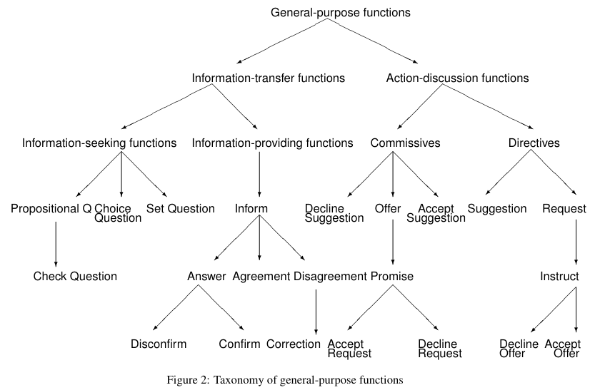

# Collecting Implicit Preferences from Human-LLM Conversations for Personalized Alignment

This project explores how implicit feedback in human–LLM conversations can be used to support personalized alignment. Existing alignment methods rely on explicit preference annotations, which are costly to scale and insufficient for modeling individual preferences. Users often signal dissatisfaction or feedback intent directly through conversation. We propose a pipeline that detects and structures these signals to construct preference data suitable for Direct Preference Optimization (DPO).

## Quick Start

```
pip install -r requirements.txt
```

## Repository Structure

```
├── data/                      # Generated data outputs
│   ├── feedback/              # Implicit feedback
│   ├── preference/            # Improved responses
│   └── dpo/                   # DPO training pairs

├── dataset/                   # Preprocessed conversation datasets

├── dialog/                    # Annotation validation and metrics

├── src/                      
│   ├── feedback/             # Implicit feedback extraction
│   ├── preference/           # Improved response construction
│   └── {lmsys,wildchat}.py   # Dataset preprocessing scripts
└── requirements.txt          
```

## Dataset Preprocessing

We preprocess large conversational datasets by filtering out non-English and potentially unsafe conversations. For testing we take a subset of 1000 conversations from each dataset.

### Wilchat-1M

Run `python src/wildchat.py`

- English conversations: 57.10%
- Clean conversations: 33.26%

Columns

```csv
conversation_id,turn,conversation,metadata
```

### LMSYS-Chat-1M

Run `python src/lmsys.py`

- English conversations: 77.75%
- Clean conversations: 27.77%

Columns

```csv
conversation_id,turn,conversation
```

## Dialog Annotation

We use the dialog act definitions defined in the [Dialog Act ISO 24617-2 standard](https://dit.uvt.nl/DIS%2024617-2_2019-09-11-HB.pdf).
Since we are interested in implicit feedback, we also annotate the turn where the topic of the conversation switches using the special token **`SWITCH`**.

- **`inform`**: performed by the sender, S, in order to make the information available to the addressee, A; S assumes that the information is correct.
- **`correction`**: performed by the sender, S, in order to inform the addressee, A, that certain information is incorrect and that the information that S provides is correct.
- **`confirm`**: performed by the sender, S, in order to inform the addressee, A, that the proposition which forms the semantic content is true.
- **`question`**: performed by the sender, S, in order to obtain the information, which S assumes that the addressee, A, possesses.
- **`request`**: performed by the sender, S, in order to make the addressee, A, perform a certain action. S assumes that A is able to perform this action.
- **`greeting`**: performed by the sender, S, in order to greet the addressee, A.
- `none`: none of the above

We use the following tree diagram to annotate the conversations:



### Prediction

To automate the annotation process, we design a prompt to classify the dialog acts using LLMs.

**Output**

- JSON array of dialog acts of `length = number_user_turns + number_topic_switchs`
- JSON array of feedback strings for each sub-conversation

**Granular Output**

- JSON array of dictionary where each key value is a feedback type and each value is the feedback content extracted from the verbatim conversation response.

Example

```
1. User query [act1]
2. LLM response
3. Feedback   [act2]
4. LLM response
5. Hi random  [act3] + SWITCH
6. LLM response

[act1, act2, SWITCH, act3]

Processing: 676b68c151f74ce5a0118e2ad87d8178
{'dialog_act': 'question', 'confidence': 0.95}
{'dialog_act': 'question', 'confidence': 0.98}
Dialog acts: ['question', 'question', 'SWITCH', 'question']
```

### Metrics

| Metric                        | What it measures                                                  |
| ----------------------------- | ----------------------------------------------------------------- |
| **Per-conversation accuracy** | Fraction of conversations with all turns perfectly predicted      |
| **Per-turn accuracy**         | Fraction of turn predictions that are correct (ignoring `SWITCH`) |
| **Per-label accuracy**        | Accuracy for each dialog act class individually                   |

## Extracting Preference Pairs

The first stage is to extract implicit preference pairs from conversations.
- Set the environment variables in `.env`

### Step 1: Implicit Feedback Extraction

Extract dialog acts and implicit feedback signals from conversations:

```bash
python src/feedback/predict.py data/lmsys.csv
```

**Output Schema**:
`conversation_id,turn,predicted_dialog,predicted_switch,conversation,metadata`

### Stage 2: Improved Response Generation

Generate improved responses based on implicit feedback signals:

```bash
python src/preference/predict.py data/feedback/lmsys.csv
```

**Output Schema**:
`conversation_id,turn,predicted_dialog,predicted_switch,predicted_preference,conversation`

### Step 3: DPO Pairs Construction (Optional)

Convert preference data to DPO pairs JSONL format:

```bash
python src/dpo/extract_pairs.py data/preference/lmsys.csv
```

**Output**: `data/dpo/{dataset}.jsonl`


## References

- [WildChat: 1M ChatGPT Interaction Logs in the Wild](https://arxiv.org/abs/2405.01470)
- [LMSYS-CHAT-1M: A Large-Scale Real World LLM Conversation Dataset](https://openreview.net/pdf?id=BOfDKxfwt0)
- [The PRSIM Alignment Dataset](https://arxiv.org/abs/2404.16019)
- [Aligning LLMs with Individual Preferences via Interaction](https://arxiv.org/abs/2410.03642)
- [Dialogue Act](https://people.ict.usc.edu/~traum/Papers/iso-2017.pdf)
